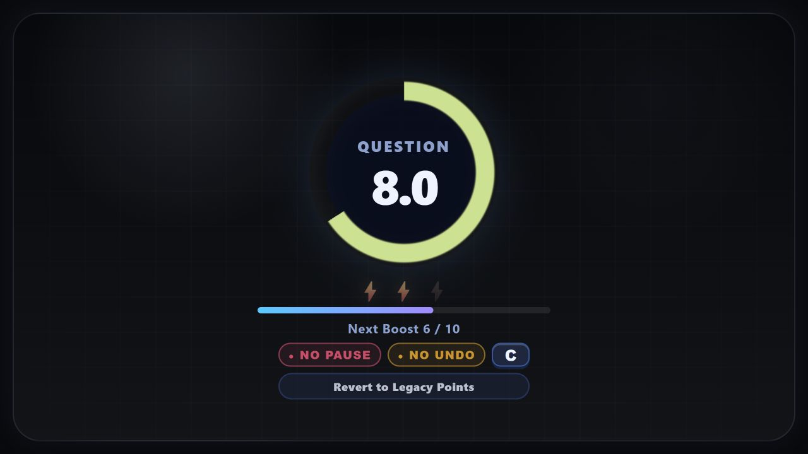
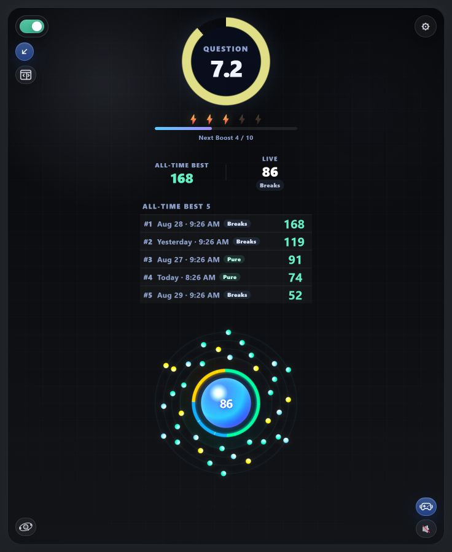
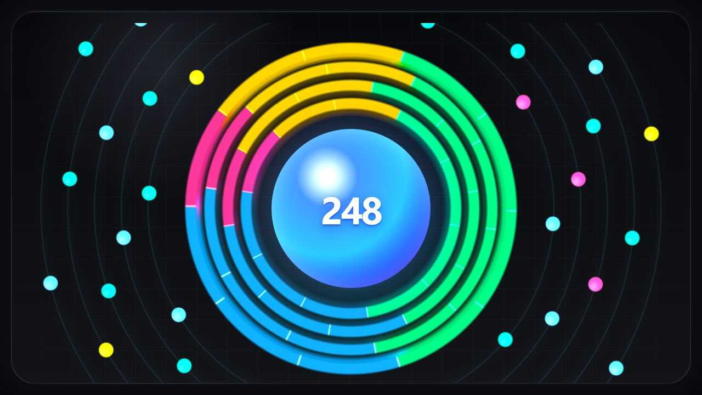
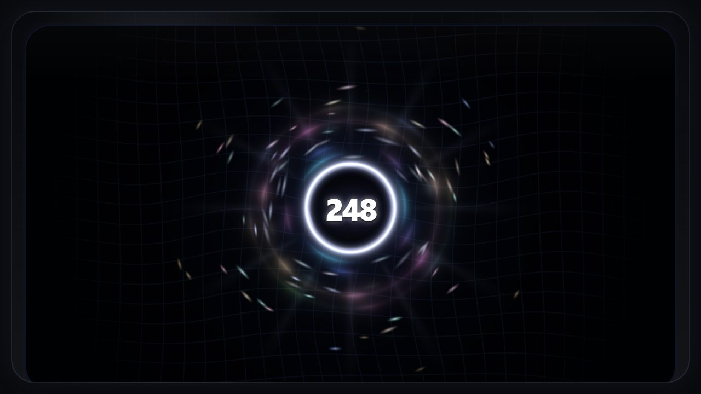

# Speed Streak 2.04

Speed Streak turns desktop Anki review into a game of focused momentum. It adds separate question and answer timers, a streak worth protecting, optional audio and controller feedback, and tools for moving past cards that consume too much of a review session.

[AnkiWeb](https://ankiweb.net/shared/info/1237336370) · [Controller setup](https://cultured-beluga-9fc.notion.site/Speed-Streak-Xbox-Controller-Setup-Instructions-32a1d706353980f3920cfe509cc96a90?pvs=74) · [Feedback on Reddit](https://www.reddit.com/message/compose/?to=henbitdeadnettle92&subject=Speed%20Streak%20feedback) · [Ko-fi](https://ko-fi.com/ankispeedstreak)

## New in 2.04

- **Streak records:** show an all-time or today target, a live comparison, or five ranked/recent streaks during review.
- **Comparable record details:** inspect active time, pauses, Review departures, restart continuation, undo use, and Pure status.
- **“Time’s Running Out” cue:** choose the warning threshold, sound, volume, and exact sound moment that lands on each whole-second mark.
- **More reliable audio startup:** packaged review effects and countdown cues are prepared ahead of time for tighter first-play timing.
- **Help / Feedback hub:** direct access to reviews, Reddit feedback, and optional Ko-fi support.
- **Experimental macOS controller vibration:** diagnostic and backend work is included, but real-controller testing is still needed.

## Main features

- Separate question and answer timers
- Special timers for note types, tags, typed-answer cards, AnKing one-by-one cards, and flagged cards
- Time Boost gameplay with optional No Pause and No Undo focus rules
- Legacy Points mode for the earlier score-and-multiplier system
- Time Drain warnings and optional countdown suspension
- Review Later marking and manager tools
- Per-event audio, synchronized countdown cues, custom sound uploads, and per-sound volume
- Optional controller haptics with configurable patterns
- Inline side panel or separate External Window with saved position presets
- Fusion Rings, Singularity, Crystal Reactor, Classic Orbit, Brick, lightweight rows, and number-only visuals
- Themes, color controls, shortcuts, and multiple performance levels

## Visual modes

| Fusion Rings | Singularity | Crystal Reactor |
| --- | --- | --- |
|  |  |  |

## Installation

The normal installation route is the [Speed Streak page on AnkiWeb](https://ankiweb.net/shared/info/1237336370).

For a manual 2.04 install, download [`speed_streak_v2_04.ankiaddon`](speed-streak-addon-v2.04/speed_streak_v2_04.ankiaddon), open it with Anki, and restart Anki when prompted.

The release folder also contains local install scripts:

- Windows: `speed-streak-addon-v2.04/install_to_anki.ps1`
- macOS/Linux: `speed-streak-addon-v2.04/install_to_anki.sh`

Existing Speed Streak profile data is stored outside the add-on folder and is preserved across normal updates.

## Platform notes

- Desktop Anki only.
- Windows with an XInput-compatible controller remains the most reliable controller-vibration setup.
- Visuals and audio are designed for Windows, macOS, and Linux.
- Controller vibration depends on the operating system, controller, driver, and available backend.
- macOS vibration support is experimental and needs real-controller testing.
- The External Window is generally the smoothest display option and is useful alongside add-ons such as AMBOSS and AnkiHub.

## Repository layout

- [`speed-streak-addon-v2.04/`](speed-streak-addon-v2.04/) — current source and installable package
- [`ankiweb/v2.04/`](ankiweb/v2.04/) — paste-ready AnkiWeb description, preview, and hosted screenshots
- Older `speed-streak-addon-*` folders — frozen historical versions
- [`CHANGELOG.md`](CHANGELOG.md) — repository-level release history

## Development

The current add-on is a native Anki add-on written in Python with an HTML/CSS/JavaScript review interface. Its build scripts generate a clean `.ankiaddon` archive with the package root in the format AnkiWeb expects.

Tests for the actively developed copy are maintained in the development workspace; the public release folder contains the production add-on source and packaging scripts.

## License

[MIT](LICENSE)
